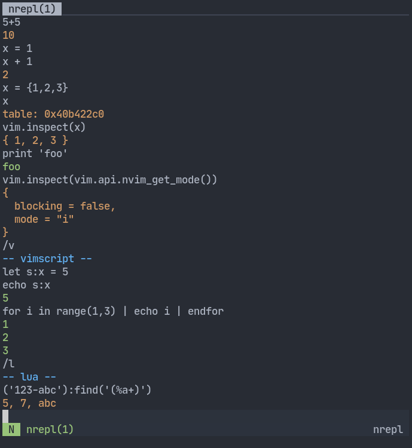

# nrepl

Neovim REPL for lua and vim script

Although already usable, it's work in progress, things can change at any time.
The name of the plugin will probably change too, since this name is apparently
already taken.

---

Start a new instance with:
```
:Repl
```

In insert mode type `/h` and enter to see available commands.



---

Starts in lua mode by default. You can switch modes with `/vim` (short version:
`/v`) for vim script and `/lua` (short version: `/l`) for lua. You can also run
one-off commands with them, like for example `/v ls` to list buffers.

Lua has its own environment, variables from the REPL won't leak to the global
environment. If by any chance you do want to add something to the global
environment, it's referenced in the `global` variable. In vim script you can use
the `s:` scope, but it's shared between instances right now.

You can switch buffer and window context with `/b` and `/w` commands, so things
like `vim.api.nvim_set_current_line()` or `:s/foo/bar/g` will run on the other
buffer.

A new REPL instance can be also spawned with `require'nrepl'.new{}`. Example
function that mimics vim's cmdwin or exmode (this mapping is included, although
it probably will get removed):
```vim
function! s:cmdwin() abort
  " get current buffer and window
  let l:bufnr = bufnr()
  let l:winid = win_getid()
  " create a new split
  split
  " spawn repl and set the context to our buffer
  call luaeval('require"nrepl".new{lang="vim",buffer=_A[1],window=_A[2]}',
    \ [l:bufnr, l:winid])
  " resize repl window and make it fixed height
  resize 10
  setlocal winfixheight
endfunction

" map it to g:
nnoremap <silent> g: <cmd>call <SID>cmdwin()<CR>
```

For the list of available options see `:h nrepl-config`.

Multiple lines can get evaluated when line continuations start with `\` as the
very first character in the line. If you need to evaluate a line that starts
with `/` or `\`, add a space before. Note that vim script has line escaping that
works just like this. So to break lines in a single expression with vim script,
there has to be two backslashes. By default you can break line in insert mode
with `CTRL-J`.

Plugin ships with its own completion, so it's best to disable other completion
plugins for the `nrepl` filetype. Also highlighting can be kinda buggy with
indent-blankline.nvim plugin, so it's good to disable that too.

It can be done by creating `ftplugin/nrepl.vim` file, for example:
```viml
let b:indent_blankline_enabled = v:false
call compe#setup({'enabled': v:false}, 0)
```

Or by setting `on_init` function in a default config:
```lua
require 'nrepl'.config{
  on_init = function(bufnr)
    -- ...
  end,
}
```

---

### TODO

- [X] Completion
  - [X] Vim script (should be the same as on the command line)
  - [X] Lua (best lua completion for neovim in town)
  - [X] REPL commands (works for commands names only, no arguments yet)
- [X] History
  - [X] Save and recall single lines
  - [X] Make history work with multiple lines
  - [ ] Save and recall context, was it lua or vimscript
- [X] Evaluate multiple lines
  - [X] Break line with `NL` (`CTRL-J`)
  - [ ] Evaluate visual selection
- [X] Context change
  - [X] Buffer
  - [X] Window
- [ ] Per instance script context for vim script
- [X] `[[`, `]]`, `[]`, `][` key bindings
- [ ] Key binding or text object for selecting last output
